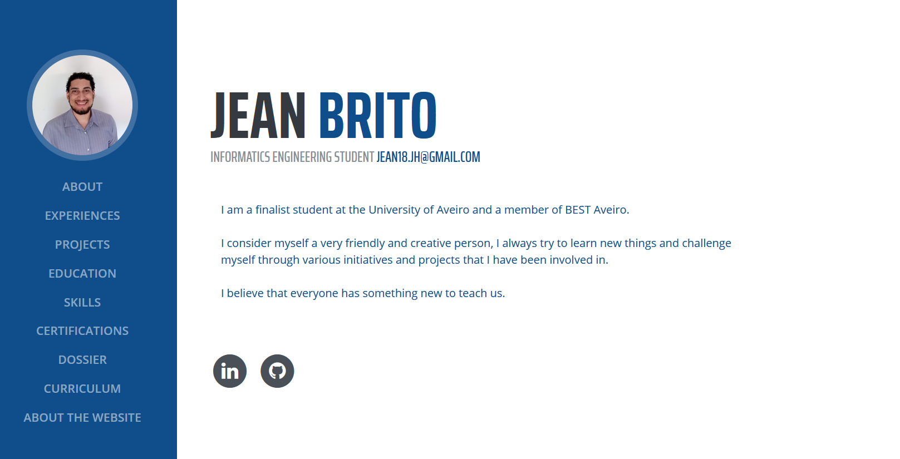

# Personal Portfolio

A dynamic Django template for personal Portfolios. Its is build to contain the The **Skills**, **Experiences**, **Projects**, **Education**, **Certificates** along with other pertinent informations. 

This webpage was build in django, the deployment were prepared for been in a *Heroku* server, the media is storaged in *Google Storage* and the static files are in the project used *WhiteNoise*. 

For local use, you can change the media roots to local and the DataBase to sqllite in  __/website/settings.py/__. Also uncomment the media line in  __/website/urls.py/__

To update the data, it was used the Django admin for all the advantages this resource brings.

## Images

The used image have a ratio of 16:9. For a better appearance, te ideal is prepare the images before upload them. Use the same ratio between all the images, at least, in the same ratio between images in the same page.

## Skills 

To insert skills, it is needed add 3 type of models interlinked with each other. From the top is , Skill Session, Skill Category and Skill, the sort follow this order too. In the information display, you can ignore the display of the Skill Category text, is just give the same name of the Skill Session.

## Static items

The used items for this project are located in __/website/static/__, however the specific for the portifolio owner are located __/website/static/icon/__ and __/website/static/image/__.

## ENV variables

* SECRET_KEY 
* DEBUG 
* ALLOWED_HOSTS 
* DEBUG_COLLECTSTATIC
* DJANGO_STATIC_HOST
* GOOGLE_CREDENTIALS
* DB_HOST
* DB_PORT
* DB_NAME
* DB_PASSWORD
* DB_USER

## Credits:

* [Website Base Template](https://github.com/user-cube/aboutMePT)
* [404 page](https://codepen.io/andrew-lawendy/pen/deOpMZ)
* [500 page](https://codepen.io/dariocorsi/pen/YOeYrJ)
* [No Content Page](https://codepen.io/ricardpriet/pen/qVZxNo)
* [css bar animation](https://www.youtube.com/watch?v=JkhhzfkXFSA)

* [Google storage](https://django-storages.readthedocs.io/en/latest/backends/gcloud.html)
* [Heroku Deployment](https://simpleisbetterthancomplex.com/tutorial/2016/08/09/how-to-deploy-django-applications-on-heroku.html)
